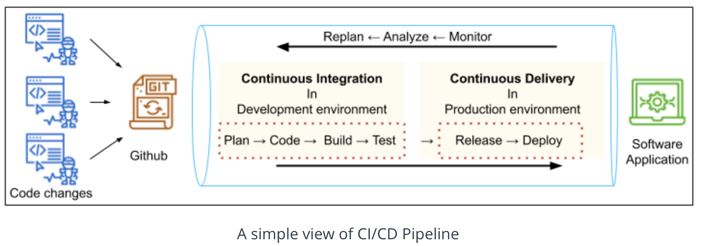

# 4. Build CI/CD Pipelines, Monitoring & Logging 

## Lesson 1: Continuous Integration and Continuous Deployment 

### What is CI/CD and Pipeline
___

# Background - What is DevOps?

We have learned that DevOps is the combination of industry best practices, and set of tools that improve an organization’s ability to: *Increase the speed of software delivery

* Increases the speed of software evolution
* Have better reliability of the software
* Have scalability using automation,
* Improved collaboration among teams. The two most important practices are - Continuous Integration / * Continuous Delivery or Deployment (CI/CD) and Infrastructure as Code (IaaC).

#### What is CI/CD?
CI/CD is a consistent and automated way for a DevOps team to build, package, test, and deploy applications

* **Continuous Integration** means newly developed code changes of a project are periodically built, tested, and integrated into a shared repository like Git. Then, the integrated code is verified and tested using automated tools.

* **Continuous Delivery** is the process of automating the release of the merged and validated code to a repository and finally release a production-ready build to the production environment.

### Pipelines Overview
One of the key best practices of DevOps is to be able to do “Infrastructure as Code”. A Pipeline enables us to store our Jenkins project configuration as code in a Git repository. **A Pipeline is a set of tools and processes to automate the CI/CD.**

The previous way of doing this was to store the configurations as text on the Jenkins server. However, it is far superior to store this in a Git repository, because that way we version it, review it, perform pull requests, and integrate it just like the rest of our code.

A pipeline contains steps that have different actions performed as part of those steps. Pipelines are written in Groovy code and designed to be reusable. Pipelines can be used similarly to how programming languages use “Modules” in a pluggable manner. The value in a Pipeline is it enables advanced functionality above and beyond simple Bash scripting. There are additional programmatic controls such as try and catch. A try/catch block creates a means of responding to errors in code or data for Jenkins functions. Pipelines assist with performing code testing and verification due to their modular nature and try/catch routines. This enables advanced error handling which lends itself to complex functionality.

As shown in the figure above, CI/CD pipeline implementation is the backbone of the modern DevOps environment. With pipelines we are able to use code checked into a Git repository to control the execution, linting, security testing, and performance testing of code. We use different environments to perform different functions, such as - development environment for building the code, staging environment for testing, and production environment for deployment.