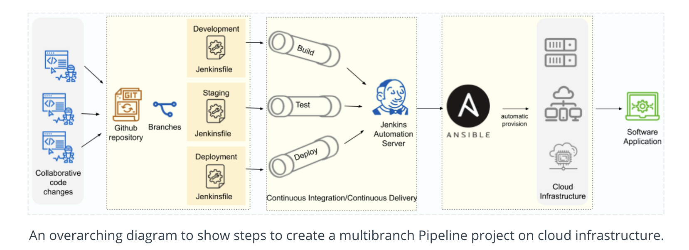

# 4. Build CI/CD Pipelines, Monitoring & Logging 

## Lesson 2: Jenkins Pipeline and Deployment Strategies 

### 5. Multiple Pipeline
___

# Steps to Create Multiple Pipelines in Blue Ocean
1. Fork/Clone the course's Github repository. - We have already done this step.
2. Create "Development", "Staging", and "Deployment" branches in your Github repository.
    * Development pipelines are kicked off very frequently and with the continuous deployment will automatically update servers
    * Staging is where QA will test the environment, so this needs to be kept more static to prevent interruptions
3. Create your Pipeline project in Blue Ocean. - We have already done this step as well.
4. Create your Pipeline with multiple stages (environments) using a Jenkinsfile for each branch.
5. Pull your updated Jenkinsfile into the other repository branches
6. Run your Pipeline on each branch individually.

### Recommended Tutorial
This Jenkins [Tutorial to Create a Multibranch Pipeline Project in Blue Ocean](https://jenkins.io/doc/tutorials/build-a-multibranch-pipeline-project/#create-your-pipeline-project-in-blue-ocean) explains the steps mentioned above.

### Multiple Pipelines
In the previous concept, we read that we can add multiple stages (environments) using a Jenkinsfile. Generally, a Pipeline should have three stages (environments) defined in a Jenkinsfile: Development (build), Staging (test), and Deployment. See a declarative Pipeline example [here](https://jenkins.io/doc/book/pipeline/#pipeline-example).

Additional Pipelines can be created by creating new branches in your Github repo. You can create more branches, with names such as "Development", "Staging", and "Deployment", in your Git repository. The diagram below shows the comprehensive steps to create a multibranch Pipeline project on cloud infrastructure. .

### Multi-Pipeline Summary
* There is no limit on the number of pipelines you can have.
* Optimize for your environment - every setup is different.
* Be careful with continuous deployment because you may overwrite the wrong thing.